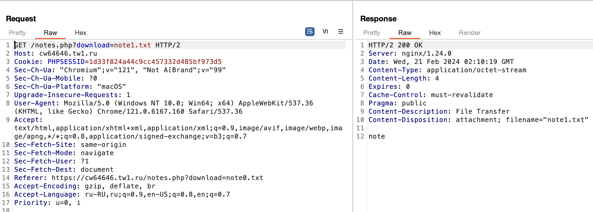
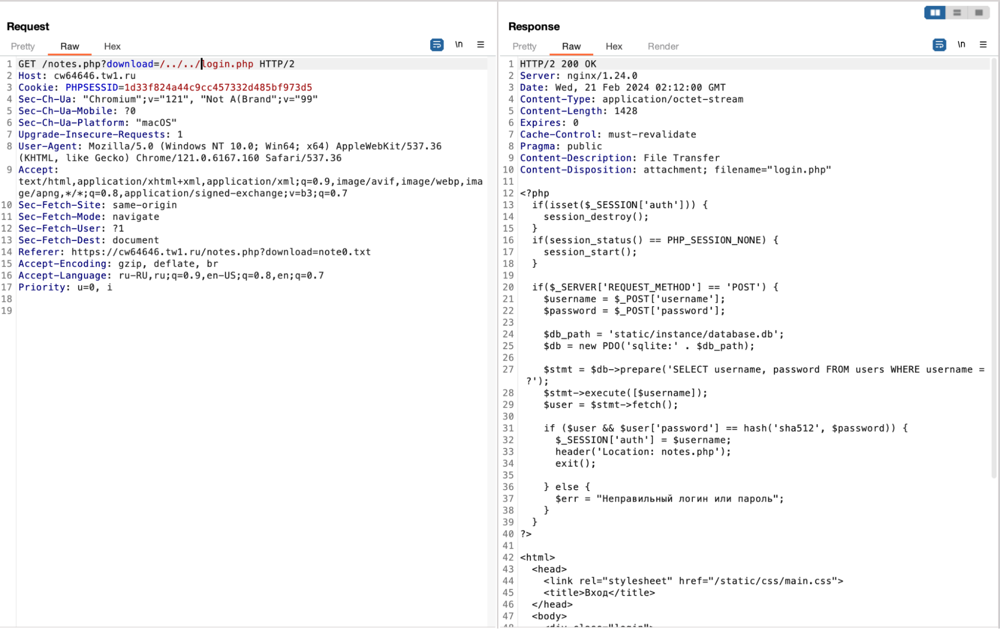
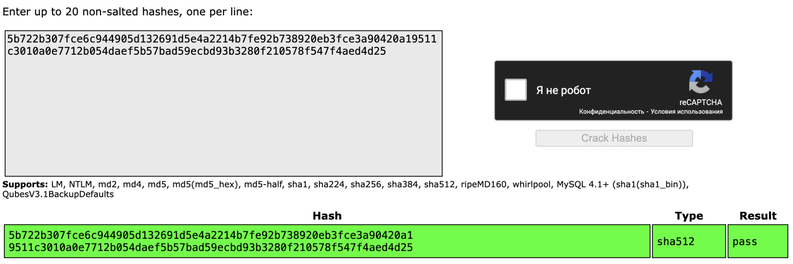
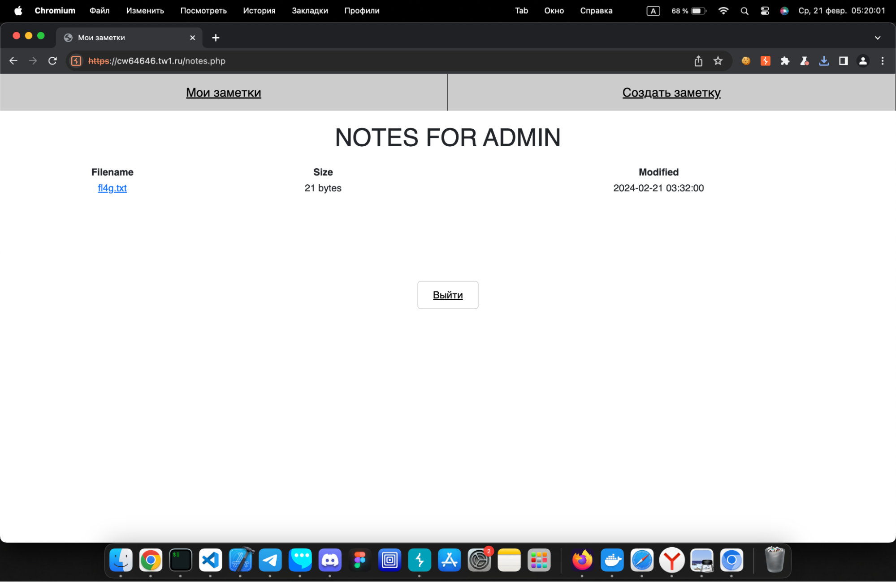

# Notes in the library | easy | web

## Информация
> Где это я? Что за странный город? Неужели то здание было порталом? Вокруг бьют молнии, дождь и ветер шумят, на холме возвышается замок. Жутковатое ощущение. Я словно бы попал в средневековый город, все жители которого вымерли… Может быть, мне снится сон? Да, наверняка. Не может же всё быть реальность. Я вообще в магию не верю. Наверное, просто упал и ударился головой. Ладно, если всё только выдумка, прогуляюсь до замка. Не стоять же на месте.

> С трудом дошел до замка на холме. Встретил нескольких людей, но они даже не взглянули на меня! И двигались странно, как тени. Весь вымок. Без сил дернул на себя ближайшую дверь. Да есть тут хоть кто-то способный мне прояснить ситуацию? Хотя, честно говоря, мне уже всё равно. В камине горит огонь. Я смогу возле него погреться. Эта пыльная комната – видимо, библиотека. Очень хочется домой, в наш мир. Может, эти записки одскажут мне, как вернуться?

## Выдать участникам
Ссылка [link](public/)

## Описание
Данное задание представляет собой приложение, в котором пользователь может создавать, сохранять и скачивать собственные заметки в текстовом виде. Каждому участнику необходимо пройти регистрацию, чтобы в дальнейшем войти в свой собственный аккаунт. Данное приложение уязвимо для атаки типа path traversal, позволяющей злоумышленнику получать несанкционированный доступ к файлам и папкам системы. Целью задания является получение логина и пароля администратора.

## Решение
Каждому участнику необходимо зарегистрироваться в приложении, чтобы иметь возможность тестировать основной функционал. Участник должен заметить при скачивании файла передачу на сервер get-параметра, содержащего имя файла, который необходимо скачать.

```http://localhost:1636/notes.php?download=note0.txt```

Лучше всего использовать BurpSuite для более удобного раскручивания этой уязвимости. Для этого можно использовать BurpProxy и Intercept. Участнику необходимо перехватить запрос на скачивание файла и попробовать изменить get-параметр и для удобства открыть его в Repeater



Далее участнику необходимо подставить login.php вместо note1.txt и вывести его исходный код. Для этого нужно несколько раз выйти из директорий и таким образом обратиться к login.php



В данном ответе участник может заметить что идет обращение к базе данных по адресу /static/instance/database.db. Далее необходимо обратиться к файлу базы данных через path traversal и вывести его содержимое


Тут можно увидеть что существуют два пользователя и рядом с ними находятся их пароли в формате sha512. Участник может расшифровать пароли через hashcat или онлайн инструменты для подбора пароля.



Таким образом можно узнать пароль от администратора и войти в его аккаунт. Далее нужно просто скачать заметку с именем “fl4g.txt”, которая доступна только админу.


